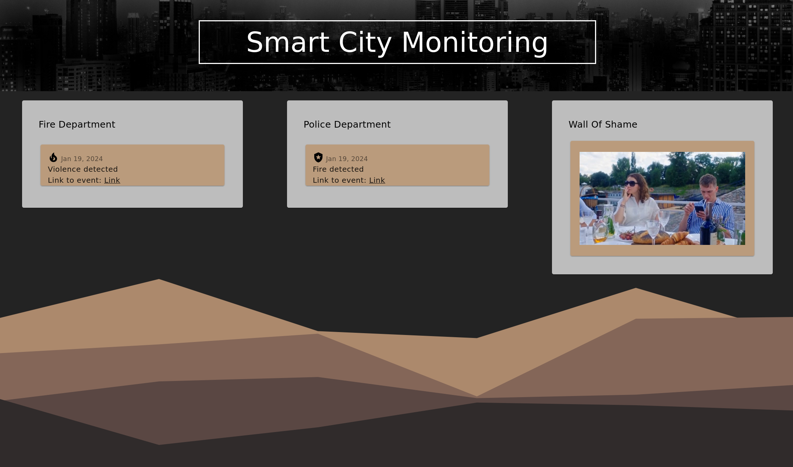

# Angular x FastApi Demo

This project is just a demo project and does not contain clean code! It is just here for demo purposes.

## Requirements

Enter the backend folder and install the dependencies for the backend from the requirements.txt file:

```bash
pip install -r requirements.txt
```

For the frontend, install the packages with npm:

```bash
npm install
```

## Start the app in debug mode

Then you can start the backend with:

```bash
uvicorn backend:app
```

and to start the frontend, enter the `frontend_ds` folder and type:

```bash
ng serve
```

## Demo

Then finally, when all the requirements are met and the aws setup is complete, you can add videos to the S3 bucket and then the State-machine is triggered. The demo should look something like this: 